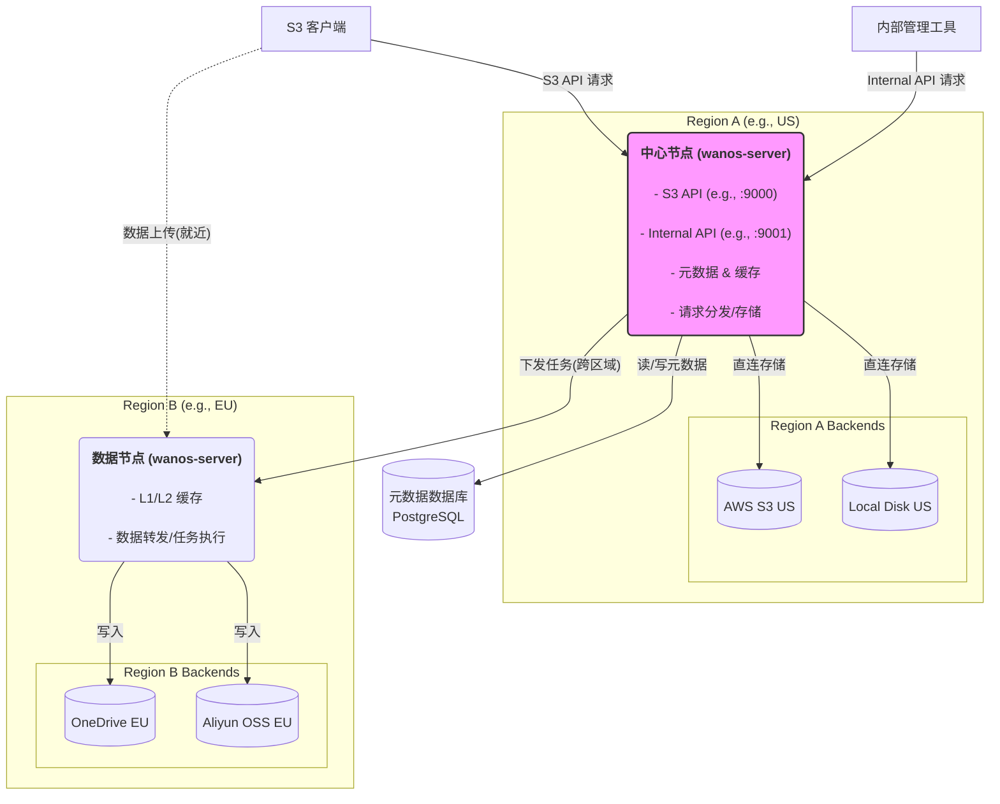
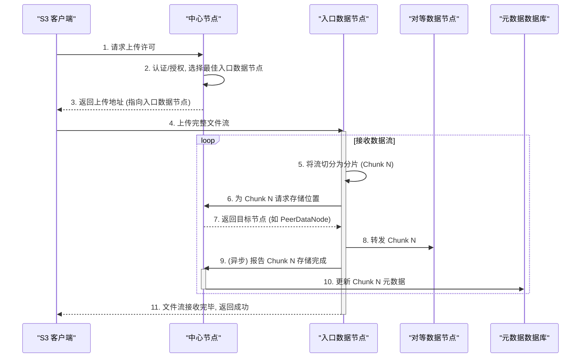

# 架构设计

本章节介绍 WANOS 的整体架构、核心角色以及关键工作流程，帮助你理解系统在多区域、多后端场景下是如何流转对象数据的。

## 核心角色与单入口中心节点

整个系统的核心是 `wanos-server` 程序，它可以根据配置运行在不同的 **角色** 下：

### 中心节点（Center Node）

中心节点是系统的「控制中枢」与「主数据节点」，主要职责包括：

- **统一入口**：
  - 对外暴露 S3 兼容 API 端口（例如 `:9000`），处理所有 Bucket / Object 相关请求。
  - 这是客户端访问系统的主要入口。
- **管理与编排**：
  - 对内暴露管理 API 端口（例如 `:9001`），用于节点管理、后端配置、任务调度等，不建议暴露到公网。
  - 负责元数据管理、请求分发、数据放置决策等核心逻辑。
- **数据决策**：
  - 根据策略决定对象数据是直接写入自身管理的后端，还是下发到其他数据节点进行存储。

### 数据节点（Data Node）

数据节点是可以水平扩展的工作节点，主要职责包括：

- **多级缓存管理**：管理本地的内存/磁盘缓存，用于加速读写和吸收突发流量。
- **数据处理执行**：按照中心节点的指令，执行具体的数据操作，例如：
  - 从后端读写对象
  - 在节点间转发分片
  - 执行压缩、加密、校验等任务
- **区域部署策略**：一般与其管理的后端存储部署在同一地理区域，以降低跨区域延迟。

中心节点与数据节点都运行同一套二进制，只是配置角色和承担的职责不同。

## 整体架构示意

下面是一个典型的两区域部署示意图：

在实际部署中，可以有多个数据节点和多个区域，上图只是示意其角色分工和数据流向。

## 典型工作流程：PutObject

以下时序图展示了一个典型的 `PutObject` 写入流程：

简要说明：

1. 客户端先向中心节点申请上传许可，中心节点完成认证授权并选择合适的入口数据节点。
2. 客户端按返回的地址，将数据流直接上传到入口数据节点。
3. 入口数据节点在接收数据的同时进行分片，并根据中心节点下发的策略，将分片分散写入不同数据节点或本节点自身。
4. 各分片写入完成后，中心节点更新元数据数据库，记录分片位置和校验信息。

## 核心机制：多级缓存（Caching）

所有数据节点都包含一个多级缓存系统，以优化 I/O 性能并降低对后端存储的压力：

- **L1：内存缓存**
  - 缓存最热的数据块，或作为高速写入缓冲区。
  - 写入可以先落入内存，快速返回客户端，再异步刷入下一级缓存或后端。
- **L2：硬盘缓存**
  - 基于本地磁盘的容量型缓存层。
  - 可缓存从后端读取的温数据，也可作为内存缓存的持久化层和数据转发的中转站，有效吸收突发写流量。

通过多级缓存，系统可以在保证一致性的前提下，兼顾高吞吐与高并发场景下的性能。

## 核心机制：分片存储（Sharding）

为了支持大文件的高效传输与弹性扩展，WANOS 采用分片（Chunk）机制：

- **文件切分**：
  - 入口节点在接收完整数据流的同时，将其实时切分为固定大小或策略控制大小的分片。
- **内部分发**：
  - 入口节点根据中心节点的全局策略，将各个分片实时分发到不同的数据节点或本节点存储。
- **元数据跟踪**：
  - 元数据数据库中不仅记录对象级信息，还维护每个对象的分片列表，包括顺序、ID、哈希值以及物理位置。
- **数据重构**：
  - 读取对象时，中心节点根据元数据找到所有分片位置，指令相关节点并行拉取，再在客户端或中心节点侧重新组装成完整文件。

这种设计使得系统可以在多节点、多区域之间灵活地分布和迁移数据，同时在大对象场景下获得更好的吞吐能力。

## 内部管理与维护任务

除了核心的数据读写流转，WANOS 还包含了一系列后台维护任务，以确保系统的长期健康与数据一致性：

- **一致性验证 (Consistency Verification)**：
  - **后端校验**：Center 会定期或按需下发任务给 DataNode，对特定后端存储进行全量分片校验，核心是验证物理文件的大小和存在性是否符合元数据记录。
  - **异常校验**：针对被记录为 `Failed` 的副本，系统会进行二次确认，以区分是临时的网络抖动还是永久性的数据丢失。

- **副本自我修复 (Self-healing)**：
  - Center 节点会定期扫描元数据，发现副本数不足（例如因节点离线、磁盘损坏或策略变更导致）的对象。
  - 系统会自动调度 DataNode 从存量副本中选取源，生成新的副本并写入健康的后端，无需人工干预。

- **元数据增量备份 (Metadata Backup)**：
  - 为了防止数据库单点故障或逻辑错误，系统支持将元数据增量备份至本地文件系统。
  - 备份采用 Protobuf 序列化格式，记录对象级视图，支持 Simple（索引）和 Full（完整元数据）两种模式。

- **垃圾回收 (Garbage Collection)**：
  - 负责清理标记为删除（Archived）的对象分片，以及超时未完成的分段上传（Multipart Upload）碎片。
  - 策略可配置，支持回收站模式（延迟删除），为误操作提供一定程度的容错。

通过这些后台机制，WANOS 实现了从单一后端接入到全局数据治理的闭环管理。
